\newpage

# Executive Summary

## Problem Definition

Many concepts within computer science and without can be easily modeled as some number of objects (nodes) which are interconnected to one another through relations (edges). See figure 1 for an example of a graph. By modeling problems in this fashion using mathematical graphs, it becomes much easier to analyze the problem at hand due to the expressiveness of graphs from an analytical perspective as well as being able to have a pictorial representation. Unlike text, graphs need not represent flow through a system linearly and can instead model more complex flows much more easily that may have many paths.

{ width=2.5in }

However, while there are countless tools for manipulating, analyzing, executing, and displaying textual data, there are much fewer tools for dealing with graphs despite their usefulness. Therefore, 2graphic will work to create a set of interrelated tools that will work together to provide an integrated development environment (IDE) for working with these graphs.

## SINAP Architecture

While Sinap does seek to be a general purpose IDE for manipulating and working with graphs, it is specifically focused upon education, and particularly on teaching various models of computing such as Turing machines, push down automata, and state machines. Therefore, the formal languages and automata plugin (FLAP) will be a key series of components in the Sinap project. Additionally, 2graphic is planning on implementing a neural networks plugin that will serve both as an independently useful component as well as demonstrating the generality of Sinap in working with different kinds of graphs.

It is key to note that both plugins are indeed plugins to Sinap and that the core program merely provides functionality that plugins may utilize to design, manipulate, and analyze various kinds of graphs as defined by the plugins. The two primary components that will be controlled and supplied through plugins will be an interpreter for carrying out operations on the graphs as well as a meta language which will be used by the editor component of Sinap to render and manipulate the graph. The interpreter is invoked by the editor component which may be fed inputs as requested by the interpreter and will produce some output. See figure 2 for the flow of the architecture.

# Background
## Domain Specific Graphic-Based Languages

A domain specific graphic-based language (DSGL) is a programming language that can be described in terms of nodes and edges that is created to solve a problem in a specific domain. A DSGL consists of a grammar and an interpreter. The grammar is a description of valid programs for the interpreter and is written in the graph meta-language. The interpreter runs valid graphs by feeding them input and producing output.

For example, the traditional circuit drawings used in electrical engineering present one example of a DSGL. In this instance, the nodes would be the various electrical components such as resistors, capacitors, and inductors while the edges represent wires connecting the components. Some inputs that might be used in this system could be an input voltage/current in the case that the circuit being represented was part of a larger circuit. Operations that can be performed on circuits might be simply reporting a particular output voltage/current at particular points, evaluating the stability of the system, etc.

## Idea Space

Sinap bears a passing resemblance to such diverse products as [JFLAP](http://www.jflap.org) and [NI LabView](http://www.ni.com/labview/). LabView is a great example of a general purpose graph-based programming environment. Sinap will allow the creation and manipulation of graphs for languages that are not applicable to general purpose programming and as such are able to more efficiently express ideas within their specific domains. Sinap will not be a direct competitor with LabView.

JFLAP is an environment in which users can create various formal machines, languages, and automata. It allows the user to step through the interpretation of these systems and convert between various classes of machines.

JFLAP provides an example of why Sinap is necessary. JFLAP is a great idea with some solid business logic, but is a nightmare for the end user. Sinap will allow the separation of the core business logic of JFLAP from the tedious task of building a GUI to expose the creation and simulation of these machines. By providing all the boilerplate components for graph editing and input/output control, Sinap will allow for an implementation of JFLAP's core features in a way that is more maintainable by allowing the logic to be focused on a single task: interpretation of graphs.

In general Sinap will allow the creation of interpreters for graph-based languages in a generic way that keeps a strict separation of concerns with regards to execution and user input. It will make the design of graph specific language interpreters simpler, faster, and more robust. For the end user this means that they will experience a consistent environment for developing programs in various DSGLs.

## Required Technology
We will take advantage of modern web technologies to create a cross-platform application. This will allow us to target all possible users without having three separate projects for UI code. Sinap will be a stand-alone and static application, requiring no backend features. We will leverage [Electron](http://electron.atom.io) or a similar project to bundle our application for all major operating systems. Another advantage of using Electron is the ability to access raw hardware and the file system. These features are not easily accessible in traditional web applications in the browser due to privacy concerns.

In order to create maintainable and readable code, we will use [Typescript](https://www.typescriptlang.org) for the majority of our project. Typescript is a super-set of Javascript with optional types and support for ES6 features. We will leverage [Angular 2](https://angular.io) to simplify UI development and help break the project up into modular components.

Sinap will be free and open source. Therefore, we have been careful to verify that the existing technologies we are using will have appropriate licensing.

## Software Requirements
Because Sinap will be developed using Electron, it will be bundled as an installation package for each major OS: MacOS, Linux, and Windows. Users will only need to download and run the appropriate installer for their OS in order to be able to use Sinap.

# Requirements Analysis

## System Architecture

{ width=70% }

Sinap will be broken into 3 main components: the active plug-in, the main GUI, and the plug-in interface.

### Main GUI

Sinap will present a GUI to the user as its primary interface. This GUI will be implemented with Angular 2 and Electron. The graph-editor will be a self contained editor inside an HTML canvas tag. It will be built into a component^[We went to a presentation by the company that created Lucid Chart. This is the approach they used to build their chart editor into their application.] to communicate with the rest of the Angular system. We will also build components that handle inputs of various arbitrary types (such as custom `image` or `list` input components). These components will be used to feed the plugins input and display the output.

### Plug-in Interface

Plug-ins for Sinap will communicate via a single API (the Plug-in Interface). This API will create an abstraction layer which will translate:

1. Descriptions of what constitutes a valid graph to the editor GUI^[The editor GUI is a separate concern from the interpreter and will be a part of its own component.]
    a. Valid kinds of nodes and edges
    b. Required nodes and/or edges
    c. Restrictions on what nodes match with which edges
2. Valid graphs to the interpreter^[The interpreter is a separate concern from the editor GUI and will be a part of its own component.]
3. What constitutes valid input to the input/test views
4. Program inputs to the interpreter
5. Interpreter state to the debugger view and output to the test/input views

### Command Line Interface

In addition to the main GUI, a CLI will be provided for the plug-in interface so that interpreters can be invoked from the command line. This will simplify testing of the plug-in interface and allow Sinap programs to be decoupled from the Sinap IDE.

## Personnel

* __Sheyne Anderson__ will be responsible for developing the Plugin API. His qualifications include over ten years of development across a wide variety of areas and fields giving him a broad perspective of utilizing and creating APIs.
* __CJ Dimaano__ will be responsible for developing the visual graph-editor component. His experience includes working with the HTML 5 canvas element from taking CS 4600 - Computer Graphics.
* __Dyllon Gagnier__ will be responsible for developing the CLI as well as plugin management (downloading new plugins, updating existing, dependencies, etc.) and security. His experience includes designing a command line testing framework for MIPS that was utilized in CS 3810, Computer Organization, at the University of Utah. He has also studied various aspects of computer networks at a graduate level.
* __Daniel James__ will be responsible for the main GUI. His experience includes having worked on and being in charge of Angular apps in his past two internships.

## System Features

### Base Features

* __IDE:__
    * _Graph Editor:_ A canvas component that will allow a user to create and edit graphs.
    * _Zooming:_ Whole IDE will be zoomable (text, etc...)
    * _Properties Panel:_ Edit both plugin specific values and display values for nodes and edges.
    * _Toolbox Panel:_ Allow user to select node types and edge types
    * _Debug Panel:_ Allow user to set break states and step through interpretation of graph.
    * _Plugin Management:_ Group plugins by type and allow users to install/delete plugins. Plugins register which file types they open.
    * _Run Panel:_ REPL to provide quick input/output.
* __FLAP Plugin:__ A collection of plugins to allow users to build automata.
    * _Support for:_ Finite Automaton, Mealy Machine, Moore Machine, Pushdown Automaton, Turing Machine, Multi-Tape Turing Machine, Grammars
* Run on all three platforms (macOS, Windows, Linux)

### Planned Features

* __IDE__
    * Auto Format graphs nicely.
    * _Input Types:_ Plugins provide type annotations for the kind of input they expect (images, text, etc...)
    * _Files Panel:_ View list of files in current project.
    * _Test Panel:_ Allow to specify list of test cases with optional expected files. Test cases can be loaded and saved to their own files.
* __FLAP Plugin:__
    * Embed subgraphs into graph.
* __Machine Learning Plugin:__ A plugin that allows users to prototype ML algorithms.
* __Scriptable Interface:__ Allow a batch of graphs to be run with sets of input easily.

### Advanced Features

* __IDE:__
    * Allow users to use stylus/drawing to create graphs and recognize shapes.
    * _Reverse Debugger:_ Allow user to step backwards through interpretation of graph once a break state is hit.
* __FLAP Plugin:__
    * Reading and writing JFLAP files.
    * Export code to simulate graph and interpretation.
* Other minor plugins to show off power of Sinap.
    * Knowledge graph/Mind map with [Neo4j](https://neo4j.com/) like query engine.
    * Circuit design
    * Education programming language for children and other beginners
    * Web framework
    * Demonstration of graph algorithms like BFS, Dijkstra's algorithm, topological sort, etc.
* Plugins that change behavior of Sinap. (ie plugin for submitting homework files.)

# Software Engineering Tools and Techniques

## Development Process

Agile will be used for the development process. What this means is that we will break development into a series of sprints lasting one to three weeks in length. Before each sprint, a number of improvements will be decided upon for the sprint as well as measures of success to determine if goals were met. In order for a measure of success to be satisfied, it must be approved by a majority of the team. While this is the official process, the measures of success and goals for a particular sprint may be amended by the team in the case that some major bug is discovered, a feature planned for the sprint is intractable due to unforeseen issues, etc.

Measures of success should be specific measureable (either qualitatively or quantitatively) items to evaluate progress on a given task.

Meetings will be held biweekly (twice per week) in order to evaluate progress each team member has made towards their current goals as well as to discuss high level design principles and overall architecture of the project. Given the slower pace of this project as compared to a typical 40 hour work week environment, this will allow for frequent communication without bogging down the team in procedural matters.

## Versioning

[GitHub](https://github.com/) will be used for the versioning system. Feature branches in GitHub will be used to give each member an isolated development workspace where milestone accomplishments can be merged into the master branch. Feature branches will be merged back to an overall development branch frequently and the development branch will be merged into master every two to three weeks.

By utilizing feature branches, the master branch will be kept in a relatively stable state suitable for use by test users as well as for demonstration purposes. Feature branches can then be used freely by team members as a way to remotely back up their work regardless of its readiness for production or testing. However, frequent merges must be performed by team members to avoid conflicts. Finally, strict adherence to this policy may be relaxed during the prototype phase due to the fact that most changes have cross cutting concerns.

## Bug/Feature Tracking

GitHub issue tracking will be used to track bugs and enhancements. Issues will be assigned to specific team members. There will be no point system in place for accomplishing tasks. However, in order to minimize overly broad and vague issues, large issues will be decomposed into sub-issues which reference the main issue. Therefore, while some issues may remain open for a long time, most issues will see progress on the issue tracker by having sub-issues resolved.

GitHub provides an easy to use interface that is simple and quick to utilize thereby helping to ensure that it will be used. Additionally, GitHub issues are also tracked even when closed thereby providing a good log for design decisions as well as any debugging that took place when fixing some issue. While documentation is critically important, it is much easier to fall behind on documentation than it is to fall behind on issue tracking.

## Testing

Test Driven Development will be used for implementing the plugin API. Therefore, tests for the plugin API will be written before this API is written in code in order to ensure extensive coverage of the plugin API. Each major component of the project will be tested individually; additionally, integration tests exercising the behavior of multiple components will be written as the project matures. The CLI will have unit tests for basic functionality. A test harness such as [Selenium](http://docs.seleniumhq.org/) will be in place primarily as a smoke test for GUI behavior, but we will not test using this test harness when other testing methods are available to exercise the desired behaviors due to the fragility of such testing harnesses.

While testing is of course critically important for complicated code, tests will not always be written for "obvious" code. In these cases, the tests themselves are oftentimes more complex than the code that is being tested thereby increasing the cost to change/add features while bringing little benefit the project. Testing will be done, but it will be done on a priority based system in order to maximize the benefits of testing while minimizing the costs. For these particular tests, automation and unit testing technologies are critical in speeding up development and forming a set of tools for quickly addressing issues as they arise.

## Documentation

GitHub.io will be used to house all documentation for the project. The documentation will be split into high level user documentation and plugin development documentation. JSDoc will be used for plugin and public API documentation. Project code will include inline documentation.

Documentation, like testing, can be incredibly helpful and important. However, it is very easy for documentation to become outdated as code changes yet documentation does not. Therefore, every effort will be made to maximize the value that documentation brings by emphasizing high level documentation and code samples over meticulous documentation of every helper function.

Furthermore, while documentation for developers can be a force multiplier for future work, emphasis will be placed upon documenting first how to utilize the GUI, then how to write plugins, and finally all other documentation. This is because the latter have the benefit of likely being competent programmers who may be expected to read at least some of the source documentation.

## Team Communication

Communication will take place primarily over Slack to discuss development progress as well as any issues that come up. Email and phone communication will be used for high priority messages in the case of emergencies. Slack provides an easy and fast interface for communication including the ability to quickly send small files back and force, set up meeting reminders, etc. Furthermore, emails have the tendency of having a low signal to noise ratio due to the lack of explicit subject filtering mechanisms (due to email being used for so many other purposes outside of this project).

## Team Meetings

There will be no formal Scrum meetings. Regularly scheduled weekly meetings will be held during designated class time when class is not in session and during Sunday afternoons. Regularly scheduled meetings will last between 1-1.5 hours. Other meetings will be scheduled as needed. As mentioned in the development process section, these meetings should be at least biweekly to facilitate speedy communication.

# Timeline

-----------------------------------------------------------------------------------------------------------------------------------------------------------
Week        Sheyne Anderson                      CJ Dimaano                 Dyllon Gagnier              Daniel James                Major Accomplishments
----------  -----------------------------------  -------------------------  --------------------------  --------------------------  -----------------------

2017-01-09  Neural Net Plugin                    Graph Composition          Unit Tests Panel            Graph Composition

2017-01-16  Neural Net Plugin                    Graph Composition          Unit Tests Panel            Graph Composition

2017-01-23  Plugin-interface specification       Flexible Edges             Neural Net Plugin           Flexible Edges

2017-01-30  Plugin-interface specification       Flexible Edges             Neural Net Plugin           Flexible Edges

2017-02-06  Debugging                            Undo/Redo                  Debugging                   Undo/Redo

2017-02-13  Debugging                            Undo/Redo                  Debugging                   Undo/Redo                   Alpha Complete

2017-02-20  Graph beautification                 Full screen mode           Moveable component windows  Moveable component windows

2017-02-27  Graph beautification                 Full screen mode           Moveable component windows  Moveable component windows

2017-03-06  Graph beautification                 Full screen mode           Custom node images          Custom node images

2017-03-13  Graph beautification specialization  Pushdown automata support  Custom node images          Custom node images

2017-03-20  Reverse debugging                    Stylus graph creation      Stylus graph creation       Reverse debugging           Beta Complete

2017-03-27  Reverse debugging                    Stylus graph creation      Stylus graph creation       Reverse debugging

2017-04-03  Reverse debugging                    Stylus graph creation      Stylus graph creation       Reverse debugging

2017-04-10  TA automation library                Knowledge graph plugin     TA automation library       Circuit design plugin

2017-04-17  TA automation library                Knowledge graph plugin     TA automation library       Circuit design plugin

2017-04-24  TA automation library                Knowledge graph plugin     TA automation library       Circuit design plugin       1.0 Release
-----------------------------------------------------------------------------------------------------------------------------------------------------------

Table: Timeline for Sinap development.

# Appendix A: UI Sketches
## Blank Canvas
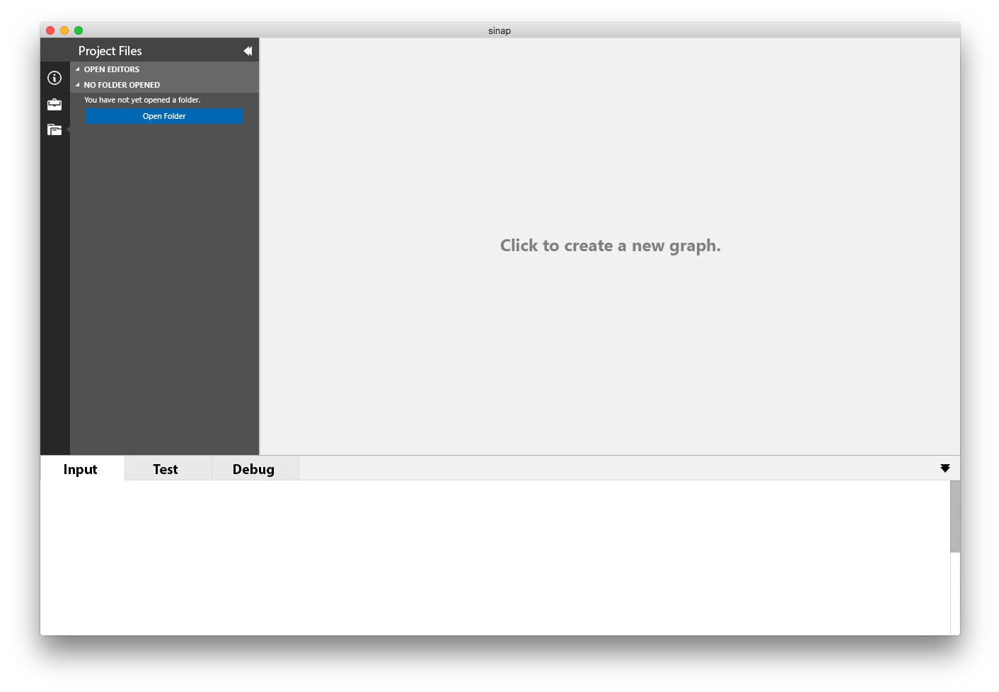{ width=100% } \

## Menu
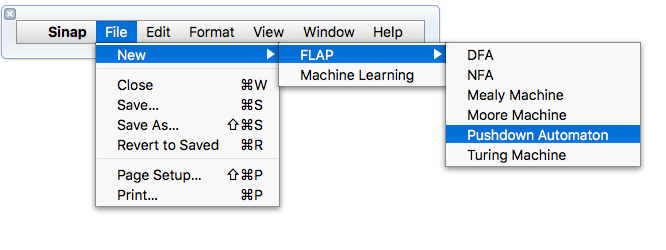{ width=100% } \

## New Dialog
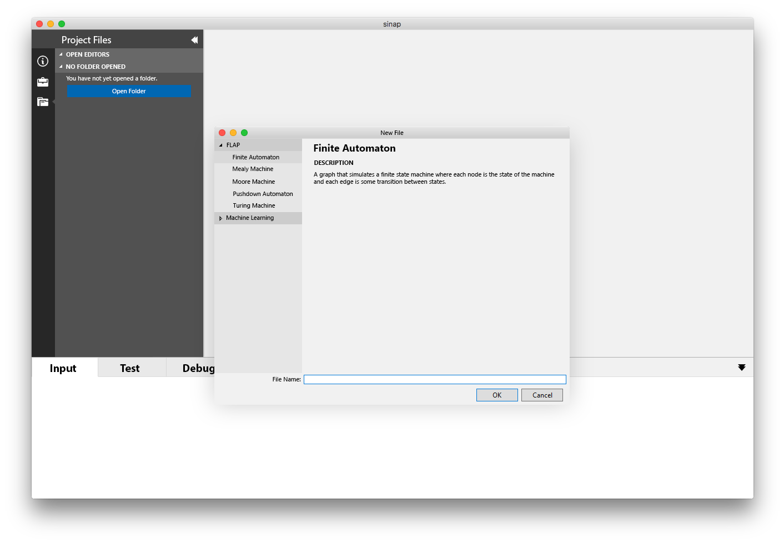{ width=100% } \

## Files Panel
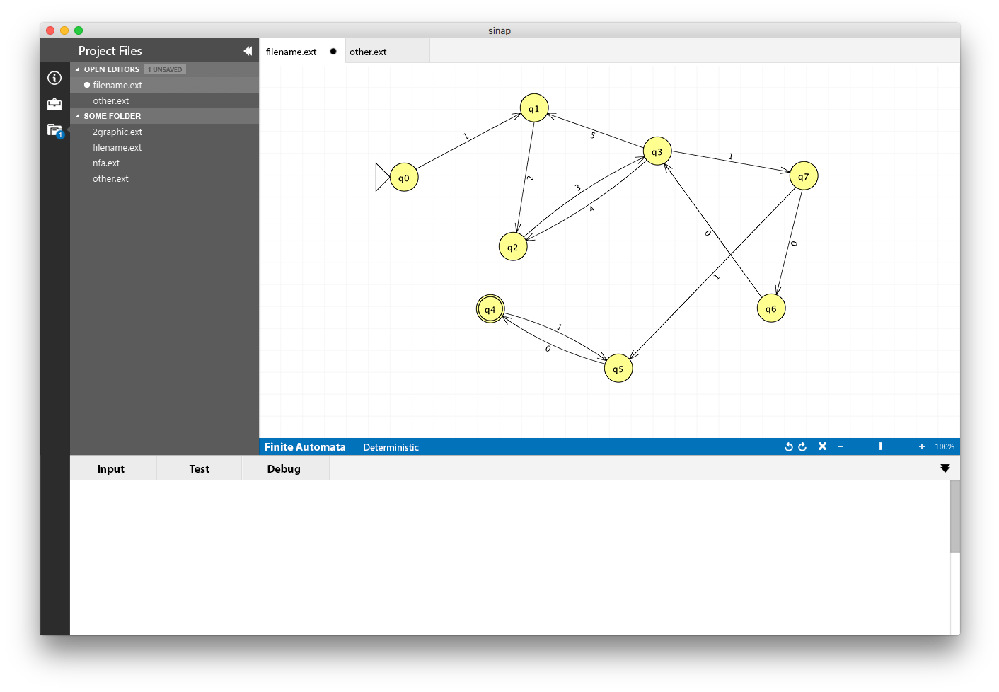{ width=100% } \

## Properties Panel
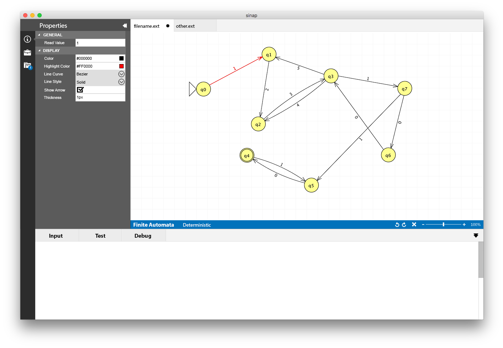{ width=100% } \

## Tools Panel
{ width=100% } \

## Input Panel
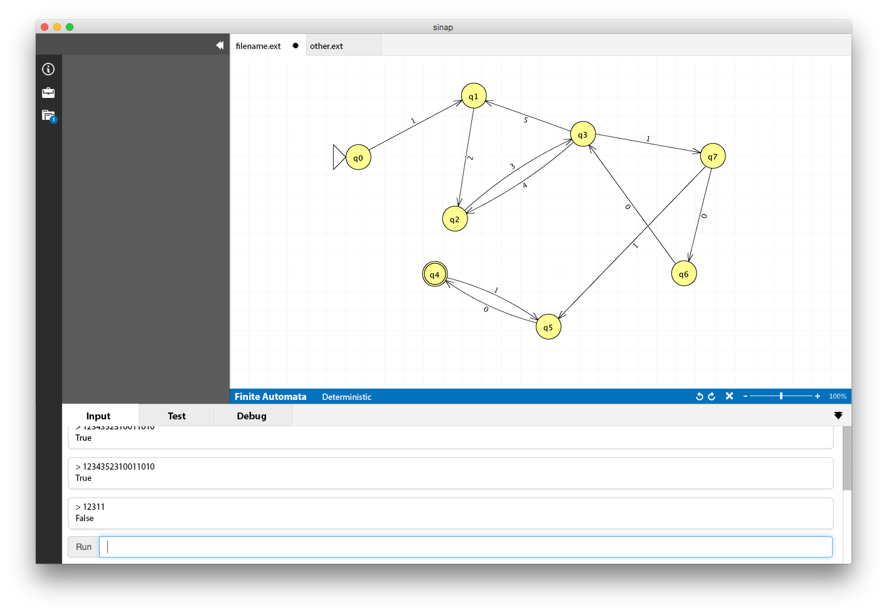{ width=100% } \

## Test Panel
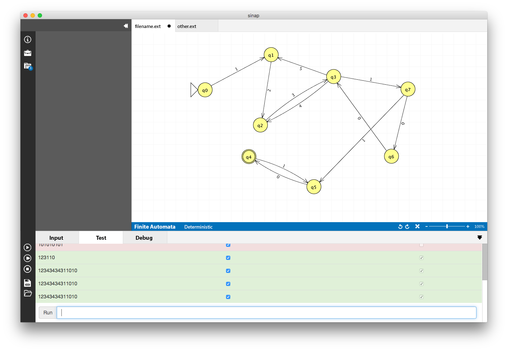{ width=100% } \

## Debug Panel
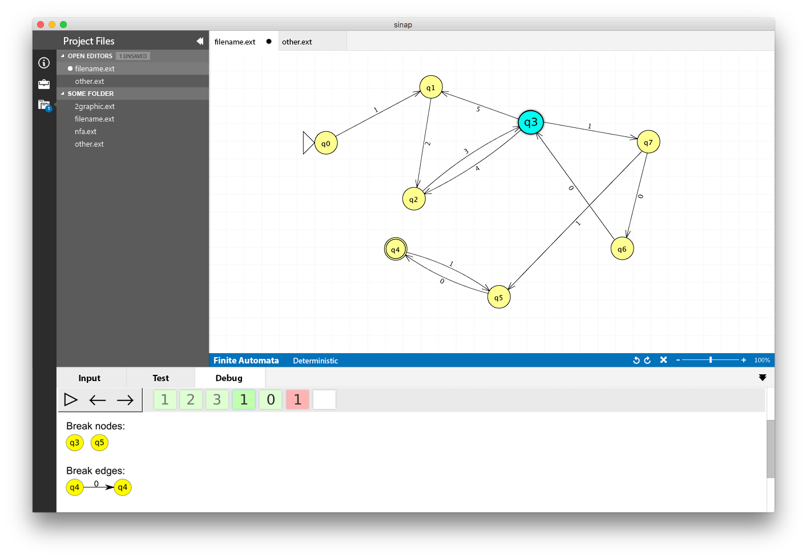{ width=100% } \

## Full Screen
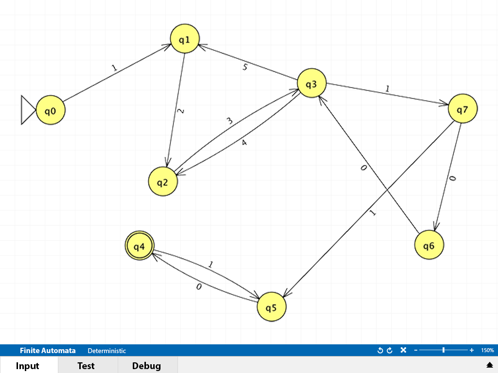{ width=100% } \

## Zoomed In
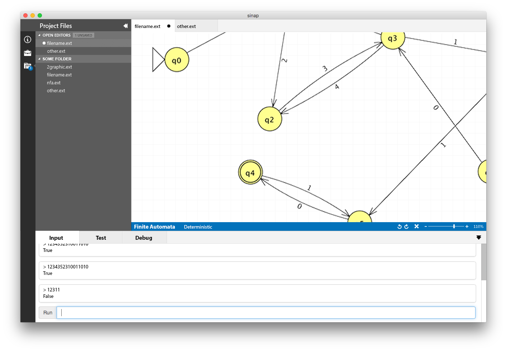{ width=100% } \

## Machine Learning Plugin
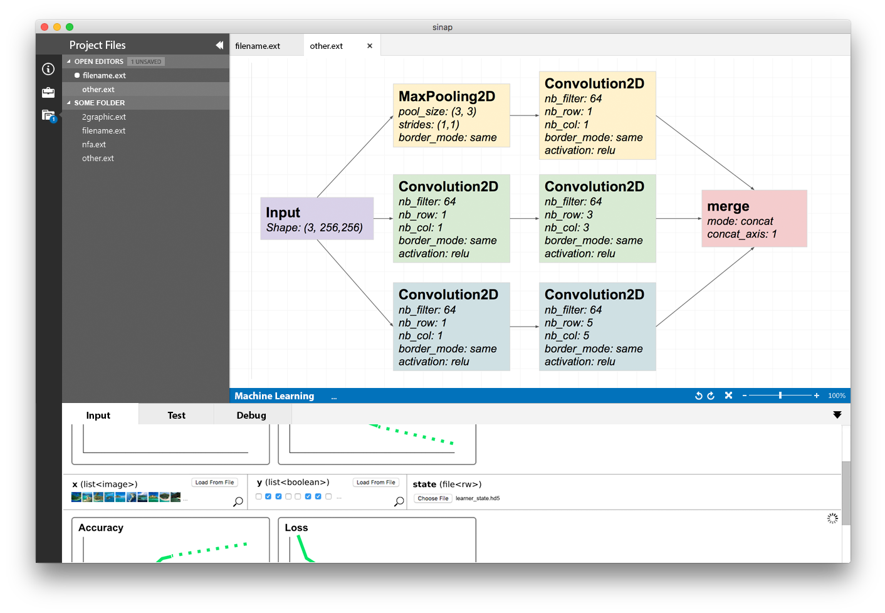{ width=png% } \

# Appendix B: Use Cases

## Writing a Graph

A user of Sinap creates and edits a graph.

### Steps

1. User selects to create a new graph type (such as a pushdown automata). See New Dialog sketch and the Menu sketch.
2. The editor populates with various graph type specific components (such as initial/final states). See the Tools Panel sketch.
3. User drags and drops components to create a computation graph.
4. Editor populates with the components as determined by the user.

### UI Sketches

- Tools Panel

## Adjusting Properties of Graph Elements

Graphs may have special properties associated with each node as specified by plugins. Users will be able to set and adjust these properties. See the Properties Panel sketch.

### Steps

1. User selects either a node or edge.
2. Sinap will display the current properties of the selected component.
3. User selects a property to adjust.
4. Sinap will present a specialized interface depending on the type of the property (i.e. things like date pickers and file dialogs).
5. User enters in desired input value.
6. Sinap validates type of input.
7. Plugin validates input for correctness and consistency.
8. Property is updated in graph for particular component.

### UI Sketches

- Properties Panel

## Running an Interpreter

A Sinap programmer will run an interpreter upon a computation graph that will accept some input and output some result (perhaps whether the input string is accepted by the language defined by the graph in the case of the formal languages and automata plugin (FLAP)). See the Input Panel sketch.

### Steps

1. User opens/creates a graph in Sinap as covered in Use Case 1.
2. User selects to see which interpreters are available for the particular type of graph.
3. Sinap presents known interpreters associated with that particular type of graph.
4. User selects one of these to run on the current graph.
5. Sinap begins execution of the interpreter.
7. Interpreter requests Sinap to get input from user.
6. User is asked for input by Sinap to feed the interpreter.
7. User inputs desired input as interpreter to program.
8. Program executes given the context of the input and graph.
9. The result of the computation is displayed to the user.

### UI Sketches

- Input Panel

## Feeding Images to a Graph

While editing certain kinds of graphs, a user will feed images to the graph. For this use case, a user already has a graph open and is in editing mode.

### Steps

1. User changes focus to the I/O view.
2. User selects the interpreter they would like to use for the graph (if multiple options are available)
3. User is presented with the expected input for the graph
    * This may be images.
    * If so, the user will input either an image or a list of images depending on the plugin.
5. User presses the run button
6. Output is displayed to the user.

### UI Sketches

- Machine Learning Plugin

## Debugging a Program

A Sinap programmer will select some number of nodes (which represent program state) as debug points, begin running a program, and then the program will halt once that node is reached and the entire current program state will be displayed to the user.

### Steps

1. User selects the debug tool.
2. User clicks on a state.
3. That state becomes emphasized in the editor.
4. User selects and then runs a program in debug mode.
5. The program halts once the selected state is reached.
6. The program emits its state to the Sinap editor.
7. The entirety of the emitted state (such as a the stack for a pushdown automata) is displayed by the editor. See the Debug Panel sketch.

### UI Sketches

- Debug Panel

## Writing Graphs on a Projector

Professors will display a graph on a large display such as a project and will edit this graph in front of an audience. All critical elements of the graph should be visible to the audience. See the Full Screen sketch.

### Steps

1. Professor launches Sinap initially in the regular use mode and selects to create a new graph.
2. Professor selects to enter presentation mode.
3. Sinap reconfigures itself, hiding most non-critical menus and bars to maximize screen real estate.
4. Professor lectures while editing graph.

### UI Sketches

- Full Screen Sketch

## Export Graphs to Images

A user will create a graph and export it to an image format suitable for reports and presentations.

### Steps

1. User creates a new graph or opens an existing graph.
2. User selects to export graph as an image in Sinap. See the Menu sketch.
3. User selects the options associated with exporting such as type of image and resolution.
4. User selects location to save the image.
5. Sinap saves the image according to the options selected in the specified file location.

### UI Sketches

- Menu

## Customized Component Look and Feel

Plugin designers will write code to specify the look and feel of both nodes and edges through a simple declarative API.

### Steps

1. Designer reads Sinap plugin documentation.
2. Designer creates custom images for nodes.
3. Designer creates a file mapping these images to node types.
4. Sinap reads the file mapping and loads the custom component pictures for the plugin.

### UI Sketch

None

## Beautify Graph

Users of Sinap will select to beautify a graph. Sinap will then make a best effort to modify the layout of the graph to be as easy to read and aesthetically pleasing as possible.

### Steps

1. User selects to beautify graph on the current graph being edited in Sinap.
2. Sinap determines which priorities and rules (such as preferring horizontal and vertical edges) by reading a simple declarative file provided by the plugin.
    + If no file is provided, Sinap will use a default set of rules suitable for generic graphs.
3. Based on these rules, Sinap will try to find a layout of the graph that matches these rules with as minimal modifications to the existing graph as possible.
4. Sinap updates the graph layout visually as well as in the graph model.
    + The beautification will **not** be saved until the user specifies to do so.

### UI Sketch

- Menu

## Composing Graphs

A user of Sinap will be able to design small sub graphs with defined inputs and outputs that can be composed together to create more complex graphs.

### Steps

1. User creates and saves a subgraph in a particular file.
2. User creates a new graph saved to a separate file.
3. User selects the file created in step 1 and selects to import it into the current graph. See the Files Panel sketch.
4. Sinap imports the content of the previous into the current graph.
5. A single black box component is displayed for the imported component.
5. User connects input edges and output edges going to and from the subgraph.
6. User can now run interpreters on the graph just as they could for any other graph.

### UI Sketch

- Blank Canvas
- Files Panel
- Tools Panel

## Bootstrapping Sinap

A new user (likely a student) of Sinap will download, install, and configure Sinap.

### Steps

1. User visits Sinap's home page.
2. User downloads Sinap.
    + This should take less than 10 minutes assuming a reasonable internet connection.
3. User executes standard installation steps for their particular operating system.
4. User opens Sinap for the first time.
5. User will configure Sinap to have their desired plugins.
6. Sinap downloads and installs these plugins.

### UI Sketch

- New Dialog

## Installing a Plugin

A user of Sinap will select and install a Sinap plugin from a git repository.

### Steps

1. Open Sinap
2. Select to install a plugin.
3. User inputs a path (which may be local or remote) to a git repository.
4. Sinap clones git repository if remote.
5. Sinap runs installation procedures for the plugin and then deletes the cloned repository (if the repository was not originally local).

### UI Sketch

- New Dialog

## Machine Learning

A student or professional of machine learning will create and run a neural network using Sinap. See the Machine Learning Plugin sketch.

### Steps

1. User creates a new neural network graph file. See the New Dialog sketch.
2. User adds in nodes/edges as well as setting various properties of these elements to create a machine learning algorithm. See the Properties Panel sketch.
3. User inputs the data that will train the neural network as well as any test data.
4. User runs neural network and produces various statistics on the algorithm (i.e. accuracy) as well as outputting the result for each input to the network.

### UI Sketch

- Machine Learning Plugin

## Creating and Running Automata

A student of models of computation will create and run a graph representing some automata such as a deterministic finite automata. See the Files Panel for an example of such a graph.

### Steps

1. Student selects the desired automata to create. See New Dialog sketch.
2. Student designs and inputs a valid automata graph into Sinap. See the input panel sketch.
3. Student selects some input to run against the graph.
4. Sinap interpreter runs the graph with the given input.
5. Sinap displays the output of the computation (generally true or false for if the input is in the formal language specified by the automata).

### UI Sketch

- Files Panel
- Input Panel

## Student Testing Graphs

A student will write and execute tests against a graph they designed to evaluate if it performs as expected. See the Test Panel sketch.

### Steps

1. Student creates tests by specifying inputs and outputs.
2. Student runs these tests in Sinap against some particular graph.
3. Sinap will run each of these tests and verify that the actual output matches the expected output.
4. The results of the tests will be displayed to the user.

### UI Sketch

- Test Panel

## TA Runs Tests

A TA of models of computation will load a student's graph into Sinap and run a pre-written common set of tests against the student's graph. See Test Panel sketch.

### Steps

1. TA starts Sinap and selects a suite of tests for a particular assignment.
2. Sinap loads these tests without an input graph. See Blank Canvas sketch.
3. TA will select a student graph to evaluate.
4. The student's graph will be loaded by Sinap into the main screen.
5. TA executes tests against the graph and views output.
6. TA loads another student's graph and goes back to step 3 continuing until all students' graphs are graded.
    * Note that the tests will only need to be selected and loaded once.

### UI Sketch

- Test Panel
- Blank Canvas
